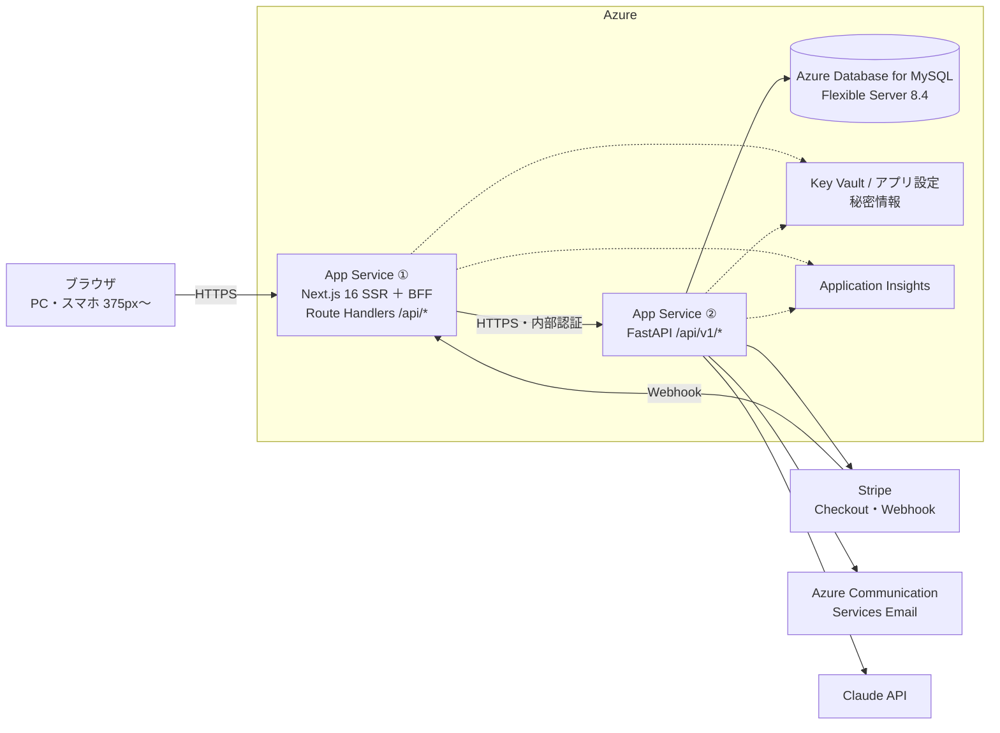
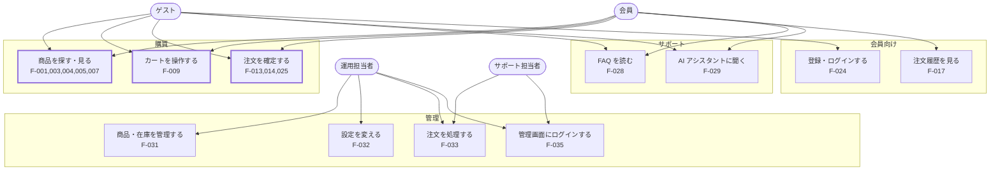
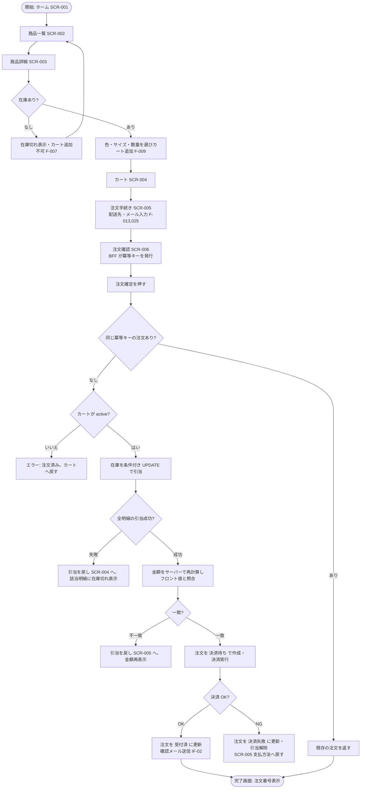
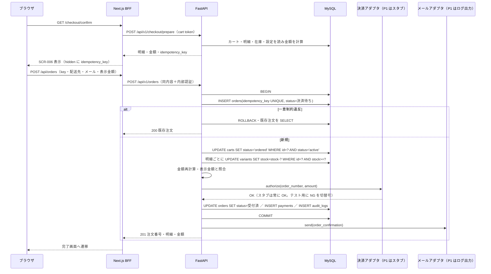
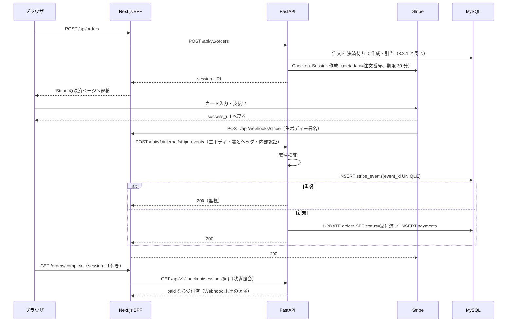
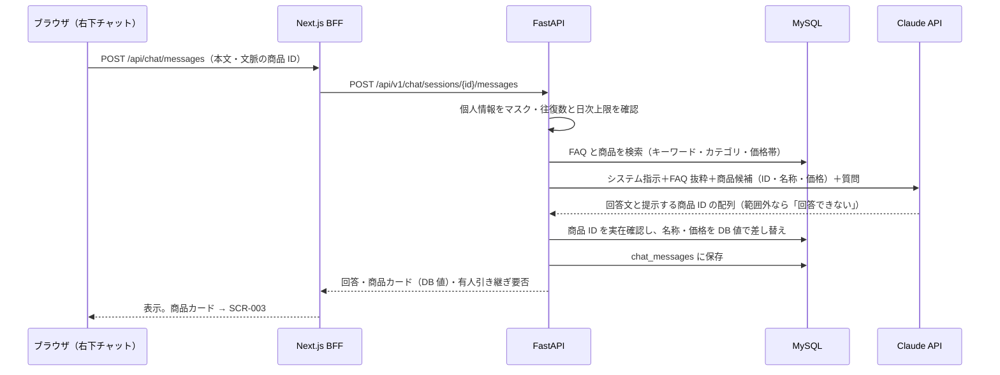
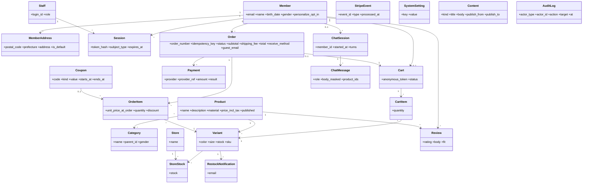
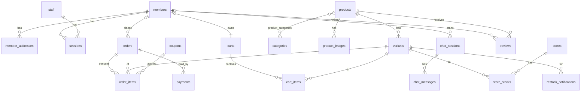

# GU EC サイト 設計仕様書（P1 本編）

| 項目 | 内容 |
| --- | --- |
| 文書番号 | GUEC-SD-01 |
| 版 | draft-v3 |
| 作成者 | Mitsuru Oya・Claude |
| 作成日 | 2026-09-07 |
| 入力 | 要求仕様書 with_ai v2.4、要件定義書 with_ai v1.3、実装フェーズ計画 v1.2 |
| 対象 | 基本設計＝Must 18 件＋F-029 概要。詳細設計＝P1（F-001,004,005,009,013,014,025,036 と F-007・F-032 の一部） |

## 改訂履歴

| 版 | 日付 | 内容 | 作成 | 承認 |
| --- | --- | --- | --- | --- |
| draft-v1 | 2026-09-07 | 初稿。統括との壁打ちで決めた設計判断 20 件と設計要件を本文化。未決 #20〜30 は推し案で仮置き | Claude | — |
| draft-v2 | 2026-09-07 | 未決 #20〜30 を統括が承認し DS-DEC-21〜31 に昇格（条件付きの項目は条件を本文へ反映）。9.5 の講義の問いに回答。精査で見つけた修正 4 件（注文後のカート再生成・ゲスト照会のメール送信方法・ホームの性別区分・8.3 の構成図）を反映 | Claude | Oya |
| draft-v3 | 2026-09-17 | 実装前レビューで見つかった矛盾 3 件・未定義 3 件を反映。4.5 エラー応答を判定順序付きの全フェーズ共通規則に差し替え（DS-DEC-32）。金額計算の税率表現（DS-DEC-31 補足）、注文番号衝突時の再生成、入力形式の正規表現と長さ上限、注文状態の列挙コードを追加 | Claude | Oya |

## 0. 本書の位置づけ

本書は V 字モデル演習の第 3 ゲート成果物で、要件定義書 v1.3 の機能 ID（F-xxx）・画面 ID（SCR-xxx）・注文状態（5.5）・異常系（5.3）を入力に、実装できる粒度まで設計を落とす。実装は実装フェーズ計画 v1.2 の P1〜P4 に分けて進めるため、本書は次の 2 層で書く。

- 基本設計（1・2・3.1・3.4・4・5・6 の画面一覧・7・8 章）は Must 18 件を対象にし、フェーズをまたいで変わらない土台（DB・API・構成）を先に固める。Lv3 新機能の AI アシスタント（F-029）は概要レベルで含める
- 詳細設計（3.2・3.3・6 の画面詳細・4 の処理仕様）は P1 の購買導線に絞る。P2 以降は追補版で差分を書く

設計要素には設計 ID を付ける。DS-SCR（画面）・DS-API（API）・DS-TBL（テーブル）・DS-PRC（処理）・DS-IF（外部 IF）・DS-DEC（設計判断）の 6 種で、10 章のトレーサビリティ表で REQ → F/SCR → DS → テスト ID をつなぐ。

draft-v1 で【要判断 #xx】としていた箇所は、2026-09-07 の統括判断で確定し DS-DEC-21〜31 に昇格した（9.2）。本文の印は外し、条件付きで承認された項目は条件を該当章に書き込んだ。

## 1. システム構成

要件定義書 0 章の構成をそのまま採用する（DS-DEC-01）。ブラウザは Next.js の BFF だけを呼び、FastAPI は BFF のオリジンからの呼び出しだけを受ける。Stripe の Webhook も BFF で受けて FastAPI へ転送する（DS-DEC-05）。



| 要素 | 役割 | 備考 |
| --- | --- | --- |
| App Service ①（Next.js） | 画面の SSR、BFF（認証 Cookie の検証・FastAPI への取り次ぎ・画面向け整形）、Stripe Webhook の入口 | Linux・B1・Always On。公開面はここだけ |
| App Service ②（FastAPI） | 業務処理・金額計算・在庫引当・DB アクセス・外部 IF 呼び出し | Linux・B1・Always On。CORS は ① のオリジンのみ。App Service のアクセス制限で ① の送信 IP のみ許可（DS-DEC-27）。Week10 で VNet に閉じる |
| Azure Database for MySQL | 全データ。自動バックアップ 7 日 | 8.4 LTS。Firewall で App Service の送信 IP のみ許可 |
| Key Vault／アプリ設定 | DB 接続文字列・Stripe 秘密鍵・Webhook 署名鍵・Claude API キー・内部認証シークレット | ソースに置かない |
| Application Insights | エラー率・応答時間の監視、閾値超過のメール通知 | 要件 6 章 |

構成を変えなかった理由は 2 つある。要件定義書 0 章で App Service（Always On）がコールドスタート要件（REQ-NFR-03）を最小の運用負荷で満たすと裁定済みであること、そして本演習が Week7 のデプロイ以降に閉域化まで進むため、公開面を Next.js の 1 台に限る構成が後工程で効くことである。

## 2. 技術スタック・バージョン

版は 2026-09-06 時点の調査に基づく。実装時に固定した版をロックファイルに残し、本表を更新する。

| 領域 | 採用 | 版 | 理由 |
| --- | --- | --- | --- |
| Node.js | Node.js | 24 LTS | Active LTS。26 は 2026-10 に LTS 化するが演習中は切り替えない |
| フロント | Next.js（App Router・TypeScript） | 16.x | 最新安定。Route Handlers を BFF に使う |
| Python | CPython | 3.13 | FastAPI 最新系で動作確認済み。App Service では起動コマンドを明示する（8 章） |
| バックエンド | FastAPI ＋ Pydantic v2 | 0.14x 系 | 型定義が入力検証を兼ねる（7 章） |
| ORM | SQLAlchemy 2.0（async）＋ asyncmy | 2.0 系 | DB 待ちの間に他リクエストを処理できる。asyncmy は MySQL 8.x の認証方式に対応 |
| マイグレーション | Alembic | 最新 | テーブル変更の履歴を残す |
| DB | MySQL | 8.4 LTS | 8.0 は 2026-04 に EOL。ローカルも Docker で 8.4 |
| 決済 | Stripe（Checkout・Webhook）、stripe-python | 15.x | 実装例が多く設計の説明がしやすい |
| メール | Azure Communication Services Email、azure-communication-email | 1.0 系 | Azure 一式との整合 |
| LLM | Claude API、anthropic | 1.x | F-029。モデルは Claude Sonnet 5 を想定 |
| 認証 | 自前（argon2id ＋ サーバー側セッション） | argon2-cffi | 外部 ID 連携の余地を残す（A-07） |
| テスト | pytest（API）、Vitest（フロント）、Stripe CLI（Webhook） | 最新 | README の jest は Vitest に変更済み |
| パッケージ管理 | pnpm、uv | 最新 | 版固定が明確（DS-DEC-24）。演習期間中は版を固定し、脆弱性は Week8 のチェックで更新する。api は App Service が requirements.txt を読むため CI で `uv export` する（8.4） |
| ローカル環境 | Docker Compose（MySQL 8.4・utf8mb4・UTC） | — | Azure と揃える（DS-DEC-25）。Azure Database for MySQL Flexible Server の 8.4 提供状況は構築時に要確認。無ければ両方 8.0（Azure 延長サポート）に揃える |

## 3. UML

### 3.1 ユースケース図

アクターは要件定義書 4 章の 4 種にゲストを加えた。Mermaid にユースケース図の記法が無いため、フローチャート記法で代替する。P1 の対象はゲストの購買導線（太枠）である。



### 3.2 アクティビティ図（購入フロー・P1）

要件定義書 5.3 の異常系のうち P1 で起きる 3 本（在庫引当失敗・決済失敗・二重送信）を分岐に入れた。決済は P1 ではスタブで、P2 で Stripe Checkout に差し替える。



### 3.3 シーケンス図

#### 3.3.1 注文確定（P1・決済スタブ）DS-PRC-014-1



引当失敗・金額不一致・決済 NG のときは、UPDATE 済みの在庫を同一トランザクション内で戻して ROLLBACK し、要件定義書 5.3 のとおり画面を戻す。決済 NG だけは注文を「決済失敗」で残す仕様なので、注文行と payments の失敗記録を COMMIT してから在庫を戻す。

#### 3.3.2 注文確定（P2・Stripe Checkout・Webhook 案 B）DS-PRC-014-2

P2 の追補で詳細化する。P1 との差分は「決済アダプタが Checkout Session を作って URL を返し、支払い結果は Webhook で受ける」点だけで、注文作成までの処理は 3.3.1 と同じ。



#### 3.3.3 AI アシスタント（P2 概要）DS-PRC-029-1



### 3.4 クラス図（エンティティ）

要件定義書 5.5 の 14 エンティティに、設計で必要になった 8 つ（セッション・冪等キーを持つ注文・Stripe イベント・監査ログ・通知申込・チャット 2 表・ログイン試行）を加えた。属性は 5 章のテーブル定義が正本で、ここでは関連だけを示す。



注文状態（order_status）は要件定義書 5.5 の 8 値を `orders.status` の列挙で持つ。遷移の制御は DS-PRC-033（管理の状況更新）と DS-PRC-014 で行い、DB には遷移表を持たない。

## 4. API 設計

### 4.1 BFF と FastAPI の役割分担（DS-DEC-06）

| 層 | パス | 呼ぶ人 | 責務 |
| --- | --- | --- | --- |
| BFF（Next.js Route Handlers） | `/api/...` | ブラウザ | 認証 Cookie の検証、CSRF トークンの検証、FastAPI への取り次ぎ（内部認証ヘッダ付与）、レスポンスの整形とエラーの隠蔽、Stripe Webhook の入口 |
| FastAPI | `/api/v1/...` | BFF のみ | 入力検証（Pydantic）、業務処理、金額計算、在庫引当、DB、外部 IF |

FastAPI の `/docs`・`/redoc`・`/openapi.json` は本番で無効化する。FastAPI は `X-Internal-Token` ヘッダで BFF からの呼び出しだけを受け付け、CORS の許可オリジンは BFF の 1 つに限る。

### 4.2 FastAPI エンドポイント一覧（基本設計・Must 18 件＋F-029）

| DS-API | メソッド | パス | 概要 | 関連 F | フェーズ |
| --- | --- | --- | --- | --- | --- |
| DS-API-001 | GET | /api/v1/categories | カテゴリ階層（性別・親子） | F-001,004 | P1 |
| DS-API-002 | GET | /api/v1/products | 商品一覧。category・gender・page。公開品のみ | F-001 | P1 |
| DS-API-003 | GET | /api/v1/products/{product_id} | 商品詳細・バリエーション・在庫有無・関連商品 | F-005,007 | P1 |
| DS-API-004 | GET | /api/v1/search?q= | キーワード検索。0 件時は代替導線（類似語・おすすめカテゴリ） | F-003 | P2 |
| DS-API-005 | GET | /api/v1/contents | 特集・お知らせ（ホーム用） | F-030 | P2（P1 はダミー） |
| DS-API-006 | GET | /api/v1/contents/{slug} | FAQ・規約・特商法などの静的ページ | F-028 | P2 |
| DS-API-010 | GET | /api/v1/cart | カート取得（Cookie の匿名トークンまたは会員）。匿名トークンは **FastAPI が発行**し（32 バイト乱数の base64url）、BFF は応答の値を Cookie に載せるだけ。トークンのカートが `ordered` なら旧カートの `anonymous_token` を NULL にしてから同じトークンで新しい `active` カートを作って返す（`anonymous_token` は UNIQUE のため。注文は `orders.cart_id` で旧カートに紐づく）。未知のトークンは無いものとして扱い新規発行する。応答に小計・送料・合計（DS-PRC-021）と明細ごとの在庫状態を含める | F-009 | P1 |
| DS-API-011 | POST | /api/v1/cart/items | 明細追加（variant_id・quantity）。在庫 0 は 409 | F-009,007 | P1 |
| DS-API-012 | PATCH | /api/v1/cart/items/{item_id} | 数量変更 | F-009 | P1 |
| DS-API-013 | DELETE | /api/v1/cart/items/{item_id} | 明細削除 | F-009 | P1 |
| DS-API-020 | GET | /api/v1/settings/public | 税率・送料ルール（表示用） | F-032,016 | P1 |
| DS-API-021 | POST | /api/v1/checkout/prepare | 金額計算・冪等キー発行（確認画面用） | F-013 | P1 |
| DS-API-022 | POST | /api/v1/orders | 注文確定（DS-PRC-014-1） | F-014,025 | P1 |
| DS-API-023 | POST | /api/v1/orders/{order_number}/lookup | ゲストの注文照会。メールは本文で受ける（URL に個人情報を載せない）。メール一致必須・レート制限 | F-017,025 | P1（完了画面）／P2 |
| DS-API-024 | GET | /api/v1/me/orders | 会員の注文履歴 | F-017 | P2 |
| DS-API-025 | GET | /api/v1/checkout/sessions/{id} | Checkout Session 状態照会（Webhook 未達の保険） | F-014 | P2 |
| DS-API-030 | POST | /api/v1/auth/register | 会員登録（メール確認トークン発行） | F-024 | P2 |
| DS-API-031 | POST | /api/v1/auth/verify-email | メール実在確認 | F-024 | P2 |
| DS-API-032 | POST | /api/v1/auth/login | ログイン（失敗回数・ロック確認、セッション再発行） | F-024 | P2 |
| DS-API-033 | POST | /api/v1/auth/logout | セッション削除 | F-024 | P2 |
| DS-API-034 | POST | /api/v1/auth/password-reset | 再設定メール送信／再設定 | F-024 | P2 |
| DS-API-040 | POST | /api/v1/chat/sessions | チャット開始 | F-029 | P2 |
| DS-API-041 | POST | /api/v1/chat/sessions/{id}/messages | 質問送信・回答（DS-PRC-029-1） | F-029 | P2 |
| DS-API-042 | POST | /api/v1/chat/sessions/{id}/handoff | 問い合わせフォームへ引き継ぎ（メール通知） | F-029 | P2 |
| DS-API-050 | POST | /api/v1/admin/auth/login | 管理ログイン（別セッション種別） | F-035 | P2 |
| DS-API-051 | GET/POST/PATCH | /api/v1/admin/products, /{id} | 商品・バリエーション・在庫・価格・公開状態・カテゴリ割当 | F-031 | P2 |
| DS-API-052 | GET/PATCH | /api/v1/admin/settings | 税率・送料・クーポン・キャンペーン | F-032 | P2 |
| DS-API-053 | GET/PATCH | /api/v1/admin/orders, /{id}/status | 注文検索・状況更新・追跡番号 | F-033 | P2 |
| DS-API-054 | GET/POST/PATCH | /api/v1/admin/contents | 特集・お知らせ・FAQ | F-034（Should） | P3 |
| DS-API-060 | POST | /api/v1/internal/stripe-events | Webhook 転送の受け口（署名検証・重複排除） | F-014 | P2 |
| DS-API-061 | GET | /api/v1/health | 死活監視 | — | P1 |

### 4.3 BFF エンドポイント（P1）

| パス | メソッド | 取り次ぎ先 | 備考 |
| --- | --- | --- | --- |
| /api/products, /api/products/[id], /api/categories | GET | DS-API-001〜003 | Server Component から直接 FastAPI を呼ぶ場合は BFF を経由しなくてよい（サーバー間通信） |
| /api/cart, /api/cart/items, /api/cart/items/[id] | GET/POST/PATCH/DELETE | DS-API-010〜013 | 匿名トークン Cookie の発行・付与 |
| /api/checkout/prepare | POST | DS-API-021 | CSRF トークン検証 |
| /api/orders | POST | DS-API-022 | CSRF トークン検証。処理中は F-036 の表示 |
| /api/orders/[orderNumber]/lookup | POST | DS-API-023 | 完了画面の再表示。メールは本文で送る |
| /api/webhooks/stripe | POST | DS-API-060 | P2。生ボディを変更せず転送 |

### 4.4 処理仕様（P1 詳細設計）

#### DS-PRC-014-1 注文確定

入力: 冪等キー、カートの匿名トークン、配送先（氏名・郵便番号・住所・電話）、メール、表示金額（小計・送料・合計）。

入力形式:

| 項目 | 形式 | 長さ |
| --- | --- | --- |
| ship_name 氏名 | 空白以外を含む | 1〜50 文字 |
| ship_postal_code 郵便番号 | ハイフンを除去後 `^\d{7}$` | 7 桁 |
| ship_address 住所（都道府県・市区町村・番地・建物を結合） | 任意文字 | 1〜200 文字 |
| ship_phone 電話 | ハイフンを除去後 `^\d{10,11}$` | 10〜11 桁 |
| guest_email メール | RFC 5322 準拠（Pydantic EmailStr） | 〜254 文字 |

出力: 注文番号、明細、金額、状態。

1. 冪等キーで `orders` に INSERT（status=決済待ち）。一意制約違反なら既存注文を返して終了
2. `carts` を `active → ordered` に条件付き UPDATE。影響 0 行なら 409（注文済み）
3. 明細ごとに `variants` を条件付き UPDATE（DS-DEC-08）。影響 0 行が 1 つでもあれば全体を ROLLBACK し、在庫切れの明細 ID を返す（409）
4. 金額を再計算する。単価は `variants → products.price_incl_tax` の現在値、送料は `system_settings` のルール（初期値: 4,990 円以上で無料、未満は設定値）。表示金額と 1 円でも違えば ROLLBACK し 409（金額変更）
5. 決済アダプタを呼ぶ。P1 はスタブで、環境変数 `PAYMENT_STUB_RESULT=ok|ng` で切替。P2 以降の Azure 環境ではこの変数を設定せず（スタブ OFF）、デプロイ時のチェック項目に「本番で `PAYMENT_STUB_RESULT` が未設定」を含める（DS-DEC-26）
6. OK なら `orders.status=受付済`、`payments` に記録、`order_items` に確定時単価を保存、`audit_logs` に記録して COMMIT。NG なら `orders.status=決済失敗` と `payments` の失敗を COMMIT した後、別トランザクションで在庫を戻しカートを `active` に戻す
7. メールアダプタを呼ぶ（P1 はログ出力）。失敗しても注文は成立させ、監査ログに残す
8. 注文番号は `GU-YYMMDD-` ＋ ランダム 8 文字（英大文字と数字、紛らわしい I/O/0/1 を除く）。生成した注文番号が UNIQUE 制約に衝突した場合は 1 回だけ再生成して再試行する（32 文字 × 8 桁で衝突確率は 10,000 件あたり約 5×10⁻⁵）

#### DS-PRC-021 金額計算（確認画面用）

カート明細の単価 × 数量の合計を小計とし、送料ルールを適用して合計を出す。税率は `system_settings.tax_rate` で、税込価格から内税額を表示用に逆算する（合計 × 税率 ÷（1 ＋ 税率）、円未満切り捨て）。金額は整数の円で扱い、浮動小数を使わない（DS-DEC-31）。商品価格は税込で持ち、税率変更時に変わるのは内税表示と `orders.tax_rate_at_order` で、売価は運用の価格改定で追従させる。税率が可変であることは受け入れテスト「税率を変えると確認画面の内税額が変わる」で示す。

`system_settings.tax_rate` は JSON の文字列 `"0.10"` で保持し、API 内では `Decimal` に変換して基点整数（10 = 10%）で扱う。内税は `合計 × 税率(%) // (100 + 税率(%))` の整数演算で求める（例: 4,530 円 → 4530×10÷110 = 411.8 → 411 円）。金額計算関数は引数が `int` 以外なら `TypeError` を投げる。空カート（明細 0 件）は金額計算の前に 409 `empty_cart` として弾く。0 円商品は seed に置かない前提とする。送料無料の閾値は**小計**（送料・値引き前の明細合計）に対して判定する。

#### DS-PRC-011 カート追加

variant の `stock > 0` かつ `products.published = true` のときだけ追加する。同じ variant が既にあれば数量を加算する。1 明細の上限は 10 点、カート合計は 50 点。上限超過は 422（4.5 の limit_exceeded）。 数量が在庫数を超えていても追加は許す（在庫の確定は注文時の引当 DS-PRC-014-1 で行う）。カート応答では明細ごとに `stock_status`（ok／insufficient＝数量 > 在庫／out_of_stock＝在庫 0）を返し、insufficient・out_of_stock が 1 つでもあれば「レジへ進む」を無効にする（ST-F009-05）。同じ variant の同時追加は `INSERT … ON DUPLICATE KEY UPDATE` で加算し、加算後に上限を検査して超過なら戻す。

#### DS-PRC-036 画面共通の状態表示

BFF への状態変更リクエスト中はボタンを無効化して処理中表示を出し、成功・失敗をトーストで示す。注文確定・削除は実行前に確認ダイアログを挟む（REQ-FR-1205）。この表示は使い勝手のためで、二重送信の防御は DS-PRC-014-1 の冪等キー側で行う。

### 4.5 エラー応答（全フェーズ共通規則・DS-DEC-32）

判定は次の順序で行い、最初に該当したものを返す。

| 順 | 問い | コード | 判定する層 |
| --- | --- | --- | --- |
| 1 | 呼び出し元は正当か（内部トークン・セッション・CSRF） | 401／403 | BFF・FastAPI の依存関数 |
| 2 | 入力は形として正しいか（型・必須・長さ・文字種・範囲） | 400 | Pydantic（DB を見ない） |
| 3 | 対象は存在し、呼び出し元のものか | 404 | リポジトリ層 |
| 4 | 入力は業務ルールを満たすか（DB の状態を見ずに決まる上限・組合せ） | 422 | サービス層（DB 参照なし） |
| 5 | 現在の DB 状態と両立するか（在庫・状態遷移・重複・金額一致） | 409 | サービス層（トランザクション内） |
| 6 | 呼び出し回数が上限内か | 429 | ミドルウェア |
| 7 | それ以外の失敗 | 500 | 例外ハンドラ |

400 と 422 の境目は「他のリクエストがどう来ても常に不正」なら 400、「形は正しいがこのサービスの規則で受けられない」なら 422。422 と 409 の境目は、DB を読まずに判定できれば 422、DB の今の状態に依存するなら 409（409 は時間が経てば成功しうる、422 は入力を変えないと成功しない）。

コード別の本文形式:

| コード | code | 本文 | 備考 |
| --- | --- | --- | --- |
| 400 | validation_error | `{code, fields:[{name, reason}]}` | FastAPI 既定の 422 を例外ハンドラで 400 に変換。reason は固定語（required／format／too_long／out_of_range） |
| 401 | unauthorized | `{code}` | 内部トークン不一致・セッション無効・期限切れ。管理画面は 302 で SCR-014 |
| 403 | forbidden | `{code}` | CSRF 不一致、ロール不足、アカウントロック中（locked_until は返さない） |
| 404 | not_found | `{code}` | 存在しない・非公開・他人のもの。3 者を区別しない |
| 409 | 業務名 | `{code, ...詳細}` | out_of_stock {items}／price_changed {amounts}／already_ordered {order_number}／invalid_transition {from, to}／duplicate {field}／empty_cart |
| 422 | limit_exceeded ほか | `{code, field, limit}` | limit_exceeded／unsupported_value |
| 429 | rate_limited | `{code}` ＋ Retry-After ヘッダ | |
| 500 | internal_error | `{code, message:"処理中にエラーが発生しました"}` | 固定文言。詳細はログのみ |

P1〜P2 の適用例:

| API | 400 | 422 | 409 |
| --- | --- | --- | --- |
| DS-API-011 カート追加 | quantity が整数でない・0 以下 | quantity > 10、カート合計 > 50 | 在庫 0（非公開は 404） |
| DS-API-022 注文確定 | 郵便番号 7 桁以外、メール形式不正、氏名 51 文字 | 受け取り方法が P1 未対応の store、支払い方法が card 以外 | 在庫引当失敗、金額不一致、カートが ordered |
| DS-API-030 会員登録 | メール形式不正、パスワード 8 文字未満 | パスワードが禁止パターン | メール既登録（duplicate。列挙防止で 200 にする場合は 7.5 に明記） |
| DS-API-032 ログイン | 必須欠落 | — | —（認証失敗は 401、回数超過は 403、回数は返さない） |
| DS-API-051 管理：商品 | 価格が負・整数でない、sku 空 | 色・サイズが許可リスト外 | sku 重複、カテゴリ不存在は 409 invalid_reference（管理者には隠す必要なし） |
| DS-API-052 管理：設定 | tax_rate が数値文字列でない | tax_rate が 0〜100% 外、送料が負 | 楽観ロック updated_at 不一致 |
| DS-API-053 管理：注文状況 | status が列挙外 | — | 遷移表に無い遷移 invalid_transition |
| DS-API-041 チャット | 本文が空・2,000 文字超 | — | 10 往復到達 turn_limit、引き継ぎ済み |

実装上の取り決め:

- Pydantic には形の検証だけを書く（業務上限は書かない。書くと 422 が 400 に化ける）
- 業務エラーは `AppError(status, code, **detail)` 1 系統で投げ、ハンドラ 1 か所で変換する。ルーターに HTTPException を直接書かない
- 4・5 の判定はサービス層に集め、UT はサービス層関数に対して行う
- 403 と 404 の順序は公開面は 404 先、管理面は 403 先
- 一覧の空結果は 200 と空配列

## 5. DB 設計

### 5.1 ER 図



### 5.2 テーブル定義（基本設計）

共通: 主キーは `id BIGINT AUTO_INCREMENT`。全表に `created_at`・`updated_at DATETIME(UTC)`。文字コード utf8mb4。金額は `INT`（円）。フェーズ列は「その表が最初に必要になる時期」。

| DS-TBL | テーブル | 主な列 | 制約・索引 | 関連 F | 初出 |
| --- | --- | --- | --- | --- | --- |
| DS-TBL-01 | members | email(UNIQUE), password_hash, name, birth_date, gender, personalize_opt_in, email_verified_at, locked_until, anonymized_at | 削除請求時は個人情報列を匿名化し行は残す | F-024,026 | P2 |
| DS-TBL-02 | member_addresses | member_id, name, postal_code, prefecture, city, address1, address2, phone, is_default | | F-026 | P2 |
| DS-TBL-03 | sessions | token_hash(UNIQUE), subject_type(member/staff), subject_id, expires_at, last_seen_at | Cookie 値の SHA-256 のみ保存 | F-024,035 | P2 |
| DS-TBL-04 | staff | login_id(UNIQUE), password_hash, role, locked_until | 単一ロール | F-035 | P2 |
| DS-TBL-05 | categories | name, slug(UNIQUE), parent_id, gender, sort_order | 階層＋性別 | F-001 | P1 |
| DS-TBL-06 | products | name, description, material, price_incl_tax, published, sort_order | 複数カテゴリは product_categories | F-001,005,031 | P1 |
| DS-TBL-07 | product_categories | product_id, category_id | 複合 UNIQUE | F-031 | P1 |
| DS-TBL-08 | product_images | product_id, path, sort_order | `path` はパスのみ保存し、配信ベース URL は環境変数 `IMAGE_BASE_URL` に持つ。P1 は Next.js の静的配信、P2 で Blob に移す際はファイルコピーと環境変数の変更のみで済む（DS-DEC-22） | F-005 | P1 |
| DS-TBL-09 | variants | product_id, color, size, sku(UNIQUE), stock | stock は条件付き UPDATE でのみ減算 | F-005,007,014 | P1 |
| DS-TBL-10 | stores | name, prefecture | ダミー 3 件 | F-006,038 | P3 |
| DS-TBL-11 | store_stocks | store_id, variant_id, stock | ダミー | F-006 | P3 |
| DS-TBL-12 | carts | member_id(NULL 可), anonymous_token(UNIQUE, NULL 可), status(active/ordered/merged) | 会員は 1 カート | F-009,010 | P1 |
| DS-TBL-13 | cart_items | cart_id, variant_id, quantity | (cart_id, variant_id) UNIQUE | F-009 | P1 |
| DS-TBL-14 | orders | order_number(UNIQUE), idempotency_key(UNIQUE), member_id(NULL 可), guest_email, status(8 値), receive_method, store_id, pickup_code, tracking_number, subtotal, shipping_fee, discount, total, tax_rate_at_order, ship_name, ship_postal_code, ship_address, ship_phone, cart_id, stripe_session_id(UNIQUE, NULL 可), expires_at | 配送先は注文時点の値をコピー。ship_name VARCHAR(50)、ship_address VARCHAR(200)、ship_phone VARCHAR(11)、guest_email VARCHAR(254) | F-014,017,033 | P1 |
| DS-TBL-15 | order_items | order_id, variant_id, product_name_at_order, color, size, unit_price_at_order, quantity, discount, coupon_id | 確定時単価・商品名を保持 | F-014 | P1 |
| DS-TBL-16 | payments | order_id, provider(stub/stripe), provider_ref, amount, result(ok/ng/refunded), refunded_amount | カード情報は持たない | F-014,037 | P1 |
| DS-TBL-17 | stripe_events | event_id(UNIQUE), type, payload_hash, processed_at | Webhook 重複排除 | F-014 | P2 |
| DS-TBL-18 | coupons | code(UNIQUE), kind(rate/amount), value, target, starts_at, ends_at, active | | F-015,032 | P2 |
| DS-TBL-19 | reviews | member_id, product_id, rating, body, fit(small/just/large), approved | サイズ感集計の元 | F-005,020 | P2 |
| DS-TBL-20 | restock_notifications | variant_id, email, member_id, notified_at | | F-007 | P2 |
| DS-TBL-21 | system_settings | key(UNIQUE), value(JSON), description | tax_rate, shipping_fee, free_shipping_threshold, payment_timeout_minutes | F-032,016 | P1 |
| DS-TBL-22 | contents | kind(feature/news/faq/static), slug(UNIQUE), title, body, publish_from, publish_to, sort_order | | F-028,030,034 | P2 |
| DS-TBL-23 | audit_logs | actor_type(member/staff/system), actor_id, action, target_type, target_id, detail(JSON), at | 90 日で削除 | NFR-04 | P1 |
| DS-TBL-24 | chat_sessions | member_id(NULL 可), anonymous_token, turns, started_at, handoff_at | 10 往復上限。削除請求・退会時は member_id を NULL にする（DS-DEC-29） | F-029 | P2 |
| DS-TBL-25 | chat_messages | chat_session_id, role(user/assistant), body_masked, product_ids(JSON) | 個人情報はマスク後。90 日で削除（監査ログと同じジョブ） | F-029 | P2 |
| DS-TBL-26 | login_attempts | subject_type, identifier, succeeded, ip, at | 5 回/15 分でロック判定 | NFR-10 | P2 |

P1 で作るのは DS-TBL-05〜09・12〜16・21・23 の 12 表（draft-v3 までは「13 表」と誤記。列挙を数えると 5＋5＋1＋1＝12。2026-09-18 実装時に修正）。ただし `orders.member_id`（NULL 可）と `carts.member_id` は P1 から列を持ち、P2 で FK を張る。

### 5.3 設計上の注意

- 確定時単価: `order_items.unit_price_at_order` と `product_name_at_order` に注文時の値をコピーし、商品マスタの価格改定が過去の注文に影響しないようにする（REQ-FR-505）
- ゲスト注文: `orders.member_id` は NULL、`guest_email` で識別。ゲスト照会は注文番号＋メール一致
- 在庫: `variants.stock` の減算は条件付き UPDATE のみ。管理画面の在庫変更（F-031）は絶対値の SET で、監査ログに前後の値を残す
- 注文状態: 8 値の列挙。遷移の妥当性はアプリで検証し、不正な遷移は 409。列挙コードは pending_payment（決済待ち）／accepted（受付済）／preparing（出荷準備中）／shipped（出荷済）／delivered（配達完了）／pickup_expired（受取期限切れ）／cancelled（キャンセル済）／payment_failed（決済失敗）。遷移表は要件定義書 5.5 が正本で、アプリの状態遷移検証関数はこの表を辞書として持つ
- 個人情報の匿名化: 削除請求時は members の個人情報列をダミー値に置換し、orders の配送先コピーも同様に置換する（要件 F-026）
- 監査ログの保持: `audit_logs.at` に索引を張り、日次ジョブで 90 日超を削除（DS-DEC-28 のスケジューラに載せる。P2）
- 初期データ（seed）: カテゴリ 3 区分、商品 30 点（色 2・サイズ 3・在庫付き）、店舗 3 件、会員 5 件、クーポン 2 件、system_settings 4 キー。Alembic のマイグレーションとは分けて `seed.py` で投入する

## 6. 画面設計

### 6.1 画面一覧と P1 対象

要件定義書 5.2 の 17 画面のうち、P1 は SCR-001〜006 を詳細設計する。SCR-013（AI アシスタント）は独立ページではなく全画面に重なる共通部品として、P2 追補でワイヤーを描く。

| DS-SCR | 画面 | P1 | ワイヤー |
| --- | --- | --- | --- |
| DS-SCR-001 | ホーム | ○ | 6.2 |
| DS-SCR-002 | 商品一覧 | ○ | 6.3 |
| DS-SCR-003 | 商品詳細 | ○ | 6.4 |
| DS-SCR-004 | カート | ○ | 6.5 |
| DS-SCR-005 | 注文手続き | ○ | 6.6 |
| DS-SCR-006 | 注文確認・完了 | ○ | 6.7 |
| DS-SCR-007〜012, 014〜017 | 会員・注文詳細・レビュー・コンテンツ・FAQ・管理・店舗 | — | P2／P3 追補 |
| DS-SCR-013 | AI アシスタント（共通部品） | — | P2 追補。右下の起動ボタンは 375px で SCR-003 の購入操作バーと重ならない位置（U-05） |

### 6.2 共通レイアウト（U-04・U-06・REQ-FR-1201/1202）

```
┌──────────────────────────────────────────────┐
│ [≡ メニュー]  GU ロゴ        [🔍][♡][🛒 3][👤] │ ← ヘッダー固定。カート点数バッジ
├──────────────────────────────────────────────┤
│                （各画面の本文）                 │
├──────────────────────────────────────────────┤
│ 企業情報 | 利用規約 | プライバシー | 特商法 | FAQ │ ← フッター（U-04）
└──────────────────────────────────────────────┘
                                        [💬] ← AI アシスタント起動（P2、右下固定）
```

オールメニュー（≡）はカテゴリ一覧・コレクション・スタイリングを画像＋文字、お知らせ・コンテンツ・FAQ・INFO をテキストリンクで並べる（U-06）。P1 では性別カテゴリと商品カテゴリの階層だけを実装する。

### 6.3 DS-SCR-001 ホーム（U-01〜U-03）

```
┌──────────────────────────────────────────────┐
│ ヘッダー（トップ画像に重ねて表示 U-01）           │
│ ┌──────────────────────────────────────────┐ │
│ │        トップ画像（特集・全幅）              │ │
│ └──────────────────────────────────────────┘ │
│ カテゴリ（画像＋文字、上下の画像が隠れない数 U-02） │
│ [WOMEN] [MEN] [KIDS・TEEN] → 全カテゴリへ       │
│ おすすめ商品（トップ画像と同じ表示形式 U-03）      │
│ ┌────┐ ┌────┐ ┌────┐ ┌────┐                   │
│ │ 商品 │ │ 商品 │ │ 商品 │ │ 商品 │ → もっと見る    │
│ └────┘ └────┘ └────┘ └────┘                   │
│ お知らせ（P2。P1 は seed の固定文）              │
└──────────────────────────────────────────────┘
```

375px では横 2 列。データは DS-API-001・002（おすすめは P1 では新着順）。

### 6.4 DS-SCR-002 商品一覧

```
┌──────────────────────────────────────────────┐
│ WOMEN > トップス            [並び替え ▾](P3)   │
│ [絞り込み](P3)                    120 件       │
│ ┌────────┐ ┌────────┐ ┌────────┐ ┌────────┐   │
│ │ 画像    │ │ 画像    │ │ 画像    │ │ 画像    │   │
│ │ 商品名  │ │ 商品名  │ │ 商品名  │ │ 商品名  │   │
│ │ ¥1,990  │ │ ¥2,990  │ │ 在庫切れ │ │ ¥1,490  │   │
│ └────────┘ └────────┘ └────────┘ └────────┘   │
│               [もっと見る]（ページング 24 件）   │
└──────────────────────────────────────────────┘
```

在庫が全バリエーションで 0 の商品は「在庫切れ」を表示する（F-007）。検索 0 件表示（F-003）は P2。

### 6.5 DS-SCR-003 商品詳細（U-05・REQ-FR-1203）

```
┌──────────────────────────────────────────────┐
│ ┌──────────────┐  商品名                       │
│ │              │  ¥1,990（税込）                │
│ │   商品画像    │  色: [● 黒] [○ 白]             │
│ │  （複数枚）   │  サイズ: [S] [M] [L]  在庫: ○   │
│ │              │  数量: [1 ▾]                   │
│ └──────────────┘  [カートに入れる]  [♡](P3)     │
│ 商品説明・素材                                  │
│ サイズ感の集計（P2）／レビュー（P3）             │
│ 関連商品                                        │
├──────────────────────────────────────────────┤ ← 375px では下部に固定バー
│ 黒 / M / 1  ¥1,990        [カートに入れる]      │   スクロール中も購入操作可
└──────────────────────────────────────────────┘
```

選んだ色・サイズの在庫が 0 なら「在庫切れ」を表示してボタンを無効化し、再入荷通知の申込（P2）へ誘導する。カート追加後はトーストとヘッダーのバッジ更新で知らせ、カートへの導線を出す。

### 6.6 DS-SCR-004 カート

```
┌──────────────────────────────────────────────┐
│ カート（2 点）                                  │
│ ┌────┐ 商品名                 数量 [2 ▾] [削除] │
│ │画像│ 黒 / M   ¥1,990 数量 2 小計 ¥3,980      │
│ └────┘ ⚠ 在庫切れのため購入できません（該当時） │
│ ...                                             │
│ 小計 ¥3,980  送料 ¥550（4,990 円以上で無料）     │
│ 合計 ¥4,530                                      │
│                 [レジへ進む]（在庫切れ明細があれば無効）│
└──────────────────────────────────────────────┘
```

### 6.7 DS-SCR-005 注文手続き

```
┌──────────────────────────────────────────────┐
│ ご注文手続き                                    │
│ ┌ 会員の方 ──────┐ ┌ ゲストで購入 ──────────┐  │
│ │ [ログイン](P2)   │ │ 登録せずに進む（P1 既定）│  │
│ └────────────────┘ └────────────────────────┘  │
│ お届け先: 氏名 / 郵便番号 / 都道府県 / 住所 / 電話 │
│ メールアドレス（注文確認の送付先）                 │
│ 受け取り方法: (●) 配送  ( ) 店舗受け取り（P2）     │
│ 支払い方法: (●) クレジットカード（P1 はテスト決済） │
│ クーポン: [        ] [適用]（P3）                 │
│                              [確認画面へ]        │
└──────────────────────────────────────────────┘
```

### 6.8 DS-SCR-006 注文確認・完了

```
┌ 確認 ─────────────────────────────────────────┐
│ 注文内容（明細・数量・単価）                      │
│ お届け先 / メール / 受け取り方法 / 支払い方法       │
│ 小計 ¥3,980 送料 ¥550（4,990 円以上で無料） 合計 ¥4,530（うち消費税 ¥411）│
│ <input type=hidden name=idempotency_key>          │
│ [戻る]                 [注文を確定する]            │ ← 押下で確認ダイアログ → 処理中表示
└──────────────────────────────────────────────┘
┌ 完了 ─────────────────────────────────────────┐
│ ご注文ありがとうございます                        │
│ 注文番号 GU-260907-7K3M9Q2X                        │
│ 確認メールを送りました（ゲストはこの画面を保存）    │
│ 注文内容・金額・お届け先の再掲                      │
│ [買い物を続ける]                                   │
└──────────────────────────────────────────────┘
```

異常時の戻し先は 3.2 のとおり。在庫切れ → SCR-004、金額変更・決済失敗 → SCR-005、注文済み（2 タブ）→ 完了画面に既存の注文番号を表示。

## 7. セキュリティ設計

### 7.1 講義必須項目のチェックリスト

| 項目 | 設計 | 検証 |
| --- | --- | --- |
| BFF（サーバーサイドプロキシ） | ブラウザは `/api/*` のみ。FastAPI の URL・鍵をブラウザに渡さない | ST: ブラウザの通信に FastAPI ホストが出ない |
| CORS | FastAPI の許可オリジンは BFF の 1 つ。ワイルドカード禁止。認証付きリクエストの `Access-Control-Allow-Credentials` は明示 | IT: 他オリジンからの preflight が拒否される |
| Swagger 非表示 | 本番は `docs_url=None, redoc_url=None, openapi_url=None` | ST: /docs が 404 |
| 型定義（SQLi 対策） | 入力は Pydantic モデル、DB アクセスは SQLAlchemy のパラメータ束縛のみ。文字列連結の SQL を禁止（レビュー観点） | UT: `' OR 1=1` を含む入力が値として扱われる |
| 金額はバックエンドで計算 | DS-PRC-014-1 手順 4。フロントの金額は表示専用で、照合に失敗すれば注文しない | IT: 改ざんした合計で 409 |
| DB Firewall | Azure MySQL のファイアウォールで App Service の送信 IP のみ許可。ローカルからは開発時の IP を都度追加 | 構築時に確認 |

### 7.2 秘密情報がフロントへ出ない仕組み（DS-DEC-13）

| 層 | 仕組み | 検証 |
| --- | --- | --- |
| 置き場 | 秘密はサーバー側環境変数のみ。`NEXT_PUBLIC_` 付き変数に秘密を入れない | UT: 環境変数ローダーが秘密名の `NEXT_PUBLIC_` を拒否 |
| コード | 秘密を触るモジュールは `import "server-only"`。クライアントから import するとビルド失敗 | CI |
| ビルド成果物 | CI でクライアントバンドルを全文検索し、注入したダミー秘密が 0 件 | IT |
| 通信 | 応答に秘密・接続文字列・内部 URL を含めない。FastAPI の例外本文をそのまま返さない | ST: 全応答を走査 |
| リポジトリ | `.env` 不コミット、`.env.example` は空値、gitleaks を CI と pre-commit に。GitHub の Secret scanning／Push protection（public リポジトリは無料）も有効化して二重にする（DS-DEC-30） | CI |
| ログ | 秘密パターンのマスクフィルタを両アプリに | UT |

### 7.3 セッション設計（DS-DEC-14）

| 項目 | 設計 |
| --- | --- |
| 方式 | サーバー側セッション。`sessions` に Cookie 値の SHA-256 を保存 |
| Cookie | HttpOnly・Secure・SameSite=Lax。会員は `sid`、管理は `asid`（別名・別種別）。会員 24 時間、管理 8 時間（要件 6 章の 24 時間より厳しい側に設定。DS-DEC-21）。`Secure` は `APP_ENV=production` のみ付与する（`http://localhost` では Secure 付き Cookie がブラウザに保存されず、ローカルの AT-01 が通らないため） |
| 固定攻撃対策 | ログイン成功時にセッション ID を再発行 |
| CSRF | 状態変更 API は BFF でトークン検証（Double Submit Cookie） |
| ロック | `login_attempts` で 5 回/15 分を判定し `locked_until` を設定。通知メール。手動解除は F-039（P3） |
| 管理画面の分離 | 同じ Next.js の `/admin`（route group で独立）＋別 Cookie。API は `/api/v1/admin/*` に隔離。Week10 の閉域化で管理面を別ホスト＋IP 制限に切り出し、公開面からの総当たり到達性を消す（DS-DEC-21） |
| 失効 | ログアウト・期限切れ・ロック時に行を削除 |
| ゲスト | 認証なし。カートは `anonymous_token` Cookie（HttpOnly・90 日） |

### 7.4 二重登録・二重課金の防止（DS-DEC-07）

| 層 | 仕組み | 検証 |
| --- | --- | --- |
| 1 | 冪等キーを `orders.idempotency_key` UNIQUE。INSERT して制約違反を捕まえる | IT: 同一キー同時 20 リクエストで注文 1 件 |
| 2 | 注文作成と同一トランザクションでカートを `active → ordered` に条件付き UPDATE | IT: 2 タブ確定で 1 件 |
| 3 | 注文 1 件に Stripe Session 1 つ（`stripe_session_id` UNIQUE） | P2 |
| 4 | `stripe_events.event_id` UNIQUE で Webhook を重複排除 | IT: 同一 event 2 回で更新 1 回 |
| 補助 | 決済待ちの期限（30 分。Stripe Checkout の expires_at 下限と同じ）で自動キャンセル・在庫戻し・カートを `active` に戻す（DS-DEC-26）。P1 はスタブが同期で結果を返すため決済待ちが残らず、実装は P2 追補。P2 では決済待ちの間カートがロックされるため「決済を再開する」「この注文を取り消す」導線を SCR-006 に設ける | IT: 期限切れ後に買い直せる（P2） |

### 7.5 内部 ID と認可（DS-DEC-12）

| 露出面 | 対策 |
| --- | --- |
| URL | 注文は注文番号、会員はセッション特定、カートは Cookie。商品は内部 ID 可 |
| API 応答 | `response_model` で白リスト化。注文・会員・カートの応答に内部 ID と外部キーを含めない。例外: カート明細の `item_id`（DS-API-012/013 の宛先として必要。所有者チェックで他人のものは 404 なので列挙されても害がない）と商品側の `variant_id`（商品は内部 ID 可） |
| 列挙 | 商品 API は公開品のみ。未公開は 404 |
| 総当たり | 注文番号はランダム 8 文字。ゲスト照会とログインにレート制限（100 件/時/IP） |
| 認可 | 全 API で所有者確認。他人のものは 404。管理 API はロール必須 |

### 7.6 その他

- 通信: 全て HTTPS（TLS 1.2 以上）。App Service の HTTPS Only を有効化
- 不正検知: 個人データ API の大量呼出（100 件/時/ID 超）を遮断しアラート（REQ-NFR-10）
- LLM: 送信前に氏名・住所・電話・カード番号らしき文字列をマスク。回答の商品は DB に実在する ID のみ。価格・在庫は DB 値で差し替える
- 監査ログ: 注文・決済・会員変更・管理操作を `audit_logs` に「誰が・いつ・何を」で記録し 90 日保持

## 8. インフラ・デプロイ設計

### 8.1 Azure リソース

| リソース | 設定 |
| --- | --- |
| App Service Plan | Linux・B1。①②を同一プランに載せる |
| App Service ①（web） | Node 24。Always On。`WEBSITES_PORT=3000`。起動: `node server.js`（Next.js standalone 出力）。`WEBSITES_CONTAINER_START_TIME_LIMIT=600` |
| App Service ②（api） | Python 3.13。Always On。起動コマンド: `gunicorn -w 2 -k uvicorn.workers.UvicornWorker -b 0.0.0.0:8000 app.main:app`（3.13 は自動検出されないため明示） |
| Azure Database for MySQL | Flexible Server 8.4、Burstable B1ms、自動バックアップ 7 日、SSL 必須、ファイアウォールは App Service の送信 IP |
| Key Vault | 秘密情報。App Service のマネージド ID で参照 |
| Application Insights | 両 App Service に接続。エラー率・応答時間のアラート |
| Communication Services（Email） | P2。Azure 管理ドメインで開始 |

### 8.2 環境変数（抜粋）

| 名前 | 置き場 | 用途 |
| --- | --- | --- |
| DATABASE_URL | api | `mysql+asyncmy://...?ssl=true` |
| INTERNAL_TOKEN | web・api | BFF → FastAPI の内部認証（共有シークレット。DS-DEC-27）。Webhook 転送の主防御は Stripe 署名検証で、これは補助 |
| IMAGE_BASE_URL | web | 商品画像の配信ベース URL（P1 は静的パス、P2 で Blob に切替。DS-DEC-22） |
| API_BASE_URL | web | FastAPI の URL（サーバー側のみ） |
| STRIPE_SECRET_KEY / STRIPE_WEBHOOK_SECRET | api | P2 |
| ACS_CONNECTION_STRING / MAIL_FROM | api | P2 |
| ANTHROPIC_API_KEY | api | P2 |
| PAYMENT_STUB_RESULT | api | P1 のスタブ切替（ok/ng） |
| SESSION_COOKIE_DOMAIN | web | |

### 8.3 ローカル開発

```
GUapp/（リポジトリルート。モノレポ）
  apps/web/        Next.js（pnpm）
  apps/api/        FastAPI（uv）
  docker-compose.yml   MySQL 8.4（utf8mb4・UTC）
  docs/
```

`docker compose up -d` で MySQL を起動し、`uv run alembic upgrade head` → `uv run python -m app.seed` → `uv run uvicorn app.main:app --reload` と `pnpm dev` で動かす。Stripe Webhook は P2 で `stripe listen --forward-to localhost:3000/api/webhooks/stripe`。docs とコードを 1 リポジトリに置く理由はトレースと引き継ぎの一元化（DS-DEC-23）。アプリの稼働は App Service 単位で独立しているため、リポジトリを 1 つにしても片方の障害が他方へ波及することはない。壊れたコードの混入は CI（テスト必須）で防ぐ。

### 8.4 デプロイ方針（Week7 に向けたメモ）

GitHub Actions で main への push をトリガに、①pytest・Vitest・gitleaks → ②ビルド（web は Next.js standalone 出力、api は `uv export --format requirements-txt > requirements.txt` を生成して App Service の Oryx ビルドに渡す） → ③App Service へデプロイ（web・api を別ジョブ）。マイグレーションはデプロイジョブの前段で `alembic upgrade head` を実行する。デプロイ後のチェックに「本番で `PAYMENT_STUB_RESULT` が未設定」を含める。P1 はローカルのみで、CI はテストと秘密スキャンまでを先に整える。

## 9. 設計上の決定・申し送り

### 9.1 設計判断（DS-DEC）

| DS-DEC | 決定 | 理由 | 次善策 |
| --- | --- | --- | --- |
| 01 | システム構成は要件定義書 0 章の A 案 | 変える理由が無い。閉域化で公開面を Next.js に限れる | Container Apps |
| 02 | MySQL 8.4 LTS | 8.0 は EOL | — |
| 03 | SQLAlchemy 2.0 async ＋ asyncmy | 同時 50 セッションでも DB 待ちで詰まらない | sync |
| 04 | Stripe Checkout | カード情報が自サイトを通らないことを一文で説明できる | Elements、PAY.JP |
| 05 | Stripe Webhook は BFF 受け・FastAPI 処理（生ボディ素通し） | 閉域化しても届く | FastAPI 直受け |
| 06 | API は BFF `/api` と FastAPI `/api/v1` の 2 層。`/docs` は本番無効 | ブラウザに FastAPI を見せない | — |
| 07 | 二重登録防止は 4 層（冪等キー UNIQUE・カート状態・Session 1 つ・event_id） | 冪等キー単体では同時到着と 2 タブを防げない | — |
| 08 | 在庫引当は条件付き UPDATE | ロック不要で一方だけ成功 | SELECT FOR UPDATE |
| 09 | 主キーは内部 BIGINT、注文番号はランダム 8 文字 | 推測されにくい。内部 ID を出さない | ULID |
| 10 | 匿名カートは DB ＋ Cookie トークン | マージ・変動通知が実装しやすい | localStorage |
| 11 | 認証はサーバー側セッション、argon2id | ロック・期限を確実に効かせる | JWT、bcrypt |
| 12 | 内部 ID 秘匿は認可を主防御に 8 面で対策 | 隠すだけでは守れない | — |
| 13 | 秘密情報は 6 層で漏えい防止 | 経路遮断と運用ルールの両方が要る | — |
| 14 | セッション設計（7.3） | — | — |
| 15 | 監査ログは DB に 90 日 | 要件の仮説値。実サービスは PCI DSS を参考に 12 か月 | — |
| 16 | 時刻 UTC・表示 JST、Alembic | Azure と揃える | — |
| 17 | メールは Azure Communication Services | Azure 一式との整合 | Resend |
| 18 | LLM は商品 ID を返し、名称・価格は DB 値で差し替え | 創作を防ぐ | — |
| 19 | UML は Mermaid | 差分管理 | draw.io |
| 20 | Vitest ＋ pytest | 設定が軽い | Jest |
| 32 | エラー応答は判定順序（認証→形→存在→業務規則→DB 状態→回数→その他）で 1 つに決める。400 と 422、422 と 409 の境目を定義 | フェーズをまたいで同じ規則で追補できる。Pydantic の既定 422 との混同を防ぐ | — |

### 9.2 draft-v1 の未決 #20〜30 の決定（2026-09-07 統括承認）

旧 #20〜30 は DS-DEC-21〜31 として確定した。条件付きの項目は条件を該当章に書き込んである。

| DS-DEC | 旧 # | 決定 | 条件・理由 | 影響章 |
| --- | --- | --- | --- | --- |
| 21 | 20 | 管理画面は同じ Next.js の `/admin`、別 Cookie（`asid`）・別セッション種別・管理 8 時間 | 同居のリスクは公開面の脆弱性の波及と総当たりの到達性。`/admin` は route group で独立させ API も `/api/v1/admin/*` に隔離済みなので、Week10 の閉域化で管理面を別ホスト＋IP 制限に切り出して総当たりリスクを消す | 6・7.3 |
| 22 | 21 | 商品画像は P1 は静的配信、P2 で Blob Storage へ | DB にはパスのみ保存し配信ベース URL は環境変数。移行はファイルコピーと環境変数変更のみでコード・DB 無変更 | 5.2・8.2 |
| 23 | 22 | モノレポ（`apps/web`・`apps/api`・`docs/` を GUapp 1 リポジトリに） | トレースと引き継ぎの一元化。稼働は App Service 単位で独立し、壊れたコードの混入は CI で防ぐ | 8.3 |
| 24 | 23 | pnpm・uv で版を固定 | 演習期間は固定し、脆弱性は Week8 のチェックで更新。api は CI で requirements.txt を export | 2・8.4 |
| 25 | 24 | ローカル DB は Docker MySQL 8.4 | 無料でオフライン開発可。Azure 側の 8.4 提供状況は構築時に要確認、無ければ両方 8.0 | 2・8.3 |
| 26 | 25 | 決済待ちの期限 30 分（Stripe Checkout の下限）。P2 で実装 | P1 はスタブが同期応答で決済待ちが残らない。P2 では決済待ち中のカートロックに対し再開・取り消し導線を設ける。P2 以降はスタブ OFF（本番で `PAYMENT_STUB_RESULT` 未設定をデプロイチェック） | 4.4・7.4 |
| 27 | 26 | Webhook 転送の内部認証は共有シークレットのヘッダ | 主防御は Stripe 署名検証、これは補助。さらに App Service ② のアクセス制限で ① の送信 IP のみ許可 | 1・4.1・8.2 |
| 28 | 27 | 期限切れ処理・90 日削除は FastAPI 内 APScheduler、5 分ごと。P2 で実装 | gunicorn の 2 ワーカーで二重実行しないよう、実行前に MySQL `GET_LOCK()` を取得した 1 プロセスだけが処理する。実サービスなら Azure Functions の Timer トリガーが適所（9.5） | 5.3・7.4 |
| 29 | 28 | チャット会話ログは 2 表にマスク後の本文のみ保存 | 有人引き継ぎのため保存中は会員に紐づけ、削除請求・退会時に member_id を NULL に。90 日で削除 | 5.2 |
| 30 | 29 | gitleaks（pre-commit・CI）＋ GitHub Secret scanning／Push protection | push 前に止められるのは gitleaks。GitHub 側は無料の保険。trufflehog は設定が重く演習では過剰 | 7.2 |
| 31 | 30 | 金額は整数の円。商品価格は税込で持つ | 税率変更で変わるのは内税表示と `tax_rate_at_order`。売価は運用の価格改定で追従（GU 実サイトと同じ）。可変であることは受け入れテスト「税率変更で内税額が変わる」で示す。税率は文字列で保存し Decimal／基点整数で演算（float 不使用） | 4.4・5.2 |

### 9.3 一般的な EC との比較（代替案の検討経緯）

2026-09-06 の調査では、新規 EC の技術選定は Node.js フルスタック・PHP 系 CMS・PostgreSQL が優勢で、「Next.js + FastAPI」で EC を本番運用した公開事例は見つからなかった。本構成は講義の前提条件（Next.js・FastAPI・Azure MySQL・App Service）を優先した選定であり、一般の既定値とは異なる。そのため、Next.js の App Service 運用（standalone・ポート・起動時間）、MySQL 8.x の認証方式と async ドライバ、LLM の創作防止の 3 点を弱点として 7・8 章で先回りした。

### 9.4 テスト設計書への申し送り

- 結合テストの必須項目: 同一冪等キー同時 20 リクエストで注文 1 件、2 タブ確定で 1 件、同一 Webhook event 2 回で更新 1 回、決済待ち期限切れ後に買い直せる、在庫 1 に同時 2 注文で 1 件のみ成功
- セキュリティ試験: IDOR（他人の注文番号で 404）、改ざん金額で 409、`/docs` が 404、他オリジンの preflight 拒否、応答とバンドルに秘密が 0 件、XSS ペイロードで Cookie が読めない、CSRF トークン無しで 403
- 受け入れ: US-01（ゲスト購入）を P1 の出口条件に。375px での全操作
- 非機能: 一覧・詳細 95%tile 2.0 秒は P2 の Azure 環境で計測
- 既知の穴（P1 受容）: DS-PRC-014-1 手順 6 の決済 NG 経路は「決済失敗を COMMIT → 別トランザクションで在庫を戻す」の 2 段。間でプロセスが落ちると在庫が引かれたまま残る。P1 はスタブが同期で戻るため実害はほぼ無い。P2 の決済待ち期限切れ処理（DS-DEC-26）で「決済失敗のまま在庫が戻っていない注文」も回収対象に含めること
- 注文番号 `GU-YYMMDD` の日付は JST で生成する（DS-DEC-16 は保存 UTC・表示 JST。顧客が見る番号なので表示側に合わせる）。UT-014-01 で日付部分を JST で検証する

### 9.5 講義の問いへの答え

「POS アプリで Functions はあり？」→ 常時応答が要る API 本体には不向き。従量課金の Functions はアイドル後にコールドスタートが発生し、REQ-NFR-03（久しぶりのアクセスでも極端に遅くならない）を満たせない。レジは営業中ずっと即応が要る処理なので App Service（Always On）を選ぶ。一方、周期処理（決済待ちの期限切れ、再入荷通知、監査ログの削除）は Functions の Timer トリガーが適所で、常時稼働が要らず、API のワーカー多重実行の問題（DS-DEC-28）も起きない。本演習では実装量を抑えるため API 内スケジューラで代替するが、実サービスなら周期処理だけ Functions に切り出す。

## 10. トレーサビリティ表（P1）

| REQ | F / SCR | DS | AT | ST | IT | UT |
| --- | --- | --- | --- | --- | --- | --- |
| REQ-FR-101,102,108 | F-001 / SCR-001,002 | DS-API-001,002・DS-TBL-05,06,09・DS-SCR-001,002 | AT-07 | ST-F001-01〜03 | IT-001-01、IT-002-01/02 | — |
| REQ-FR-109,1201,1202 | F-004 / 共通 | DS-SCR 共通・DS-API-001,010 | AT-04、AT-07 | ST-F004-01 | IT-010-01 | UT-WEB-01 |
| REQ-FR-201,202,206,207,1203 | F-005 / SCR-003 | DS-API-003・DS-TBL-06,08,09・DS-SCR-003 | AT-02 | ST-F005-01〜03 | IT-003-01/02 | UT-WEB-07 |
| REQ-FR-204 | F-007（表示） / SCR-002,003 | DS-API-003,011・DS-PRC-011 | AT-03 | ST-F007-01 | IT-011-02 | UT-WEB-08 |
| REQ-FR-401,402,403,407 | F-009 / SCR-004 | DS-API-010〜013・DS-TBL-12,13・DS-PRC-011 | AT-04、AT-06 | ST-F009-01〜05 | IT-010-01/02、IT-011-01〜04、IT-012-01 | UT-011-01 |
| REQ-FR-501,502,503 | F-013 / SCR-005,006 | DS-API-020,021・DS-PRC-021・DS-SCR-005,006 | AT-01、AT-08 | ST-F013-01/02 | IT-020-01、IT-021-01/02 | UT-021-01〜05、UT-VAL-01/02 |
| REQ-FR-504,505 | F-014 / SCR-006 | DS-API-022・DS-PRC-014-1・DS-TBL-14,15,16,23 | AT-01 | ST-F014-01〜06 | IT-014-01〜09 | UT-014-01〜05 |
| REQ-FR-804 | F-025 / SCR-005,006 | DS-API-022,023 | AT-01 | ST-F025-01〜03 | IT-023-01/02 | — |
| REQ-FR-1102（データ） | F-032（一部） | DS-API-020・DS-TBL-21 | AT-08 | ST-F032-01/02 | IT-020-01 | UT-021-04 |
| REQ-FR-1204,1205 | F-036 / 全画面 | DS-PRC-036 | AT-05 | ST-F036-01 | — | UT-WEB-02/03 |
| REQ-NFR-04 | — | DS-TBL-23 | — | ST-NFR-02 | IT-014-01 | — |
| REQ-NFR-06,07,08 | — | 7 章 | — | ST-SEC-01〜11 | IT-060-01、IT-CORS-01、IT-BFF-01/02 | UT-SEC-01/02、UT-WEB-05（UT-WEB-06 は CI） |
| REQ-NFR-09 | — | 6 章（375px） | AT-02 | ST-NFR-01 | — | UT-WEB-07 |
| REQ-CO-06 | — | DS-DEC-04・DS-TBL-16 | — | ST-F014-01（payments にカード情報なし） | IT-014-01 | — |

P2 以降の行は追補で追加する。
